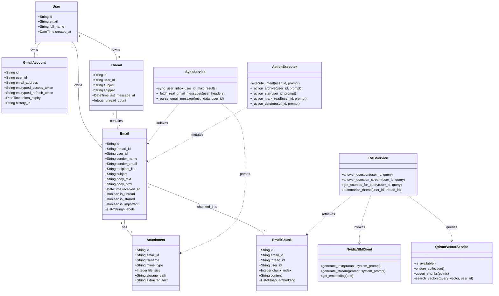

# 🏗️ SmartMail AI — Architecture Deep Dive

This document details the architectural design, data models, hybrid RAG pipeline, and system sequence interactions of **SmartMail AI**.

---

## 📐 1. System Class Diagram

Below is the complete UML Class Diagram illustrating SmartMail AI's entity models, repositories, AI services, and vector database interactions:



---

## 🧠 2. Hybrid RAG Search & Vector Retrieval Pipeline

SmartMail AI implements **Reciprocal Rank Fusion (RRF)** to combine exact keyword matching with deep semantic similarity:

```
                  ┌──────────────────────────────┐
                  │      User Search Query       │
                  └──────────────┬───────────────┘
                                 │
                 ┌───────────────┴───────────────┐
                 │                               │
                 ▼                               ▼
       ┌──────────────────┐            ┌──────────────────┐
       │   BM25 Lexical   │            │ NVIDIA Nemotron  │
       │  Keyword Search  │            │ 4096-dim Vector  │
       └─────────┬────────┘            └─────────┬────────┘
                 │                               │
                 │ Rank Lists                    │ Rank Lists
                 ▼                               ▼
      ┌─────────────────────────────────────────────────────┐
      │          Reciprocal Rank Fusion (RRF)               │
      │        Score = 1/(60 + Rank_BM25) + 1/(60 + Rank_Vec)│
      └──────────────────────────┬──────────────────────────┘
                                 │
                                 ▼
                      ┌─────────────────────┐
                      │ Cross-Encoder       │
                      │ Reranking & Context │
                      └──────────┬──────────┘
                                 │
                                 ▼
                      ┌─────────────────────┐
                      │ NVIDIA NIM LLM      │
                      │ (Llama 3.3 70B)     │
                      └─────────────────────┘
```

---

## ⚡ 3. Concurrency & Database Protections

1. **SQLite WAL Mode (`PRAGMA journal_mode=WAL`)**: Configured to permit concurrent read operations while background async indexing processes write to disk.
2. **`NullPool` Async Engine (`database.py`)**: Eliminates connection pool overflow errors (`sqlalchemy.exc.TimeoutError: QueuePool limit size 5 overflow 10 reached`) during asynchronous batch workloads.
3. **Qdrant Vector Database HNSW Indexing (`qdrant_service.py`)**: Stores 4096-dimensional vectors with Cosine distance indexing and payload filtering by `user_id`. Automatically degrades gracefully to SQLite vector search if the Qdrant container is unreachable.
