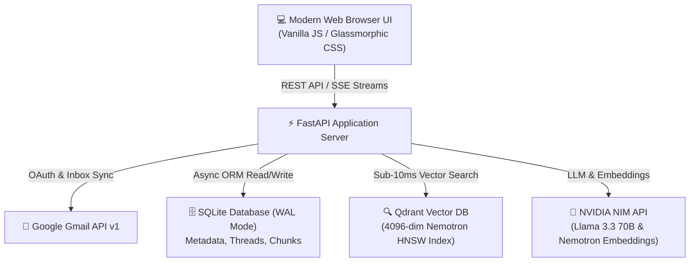

# 📧 SmartMail AI

> **An Enterprise-Grade, AI-Powered Gmail Client with Hybrid RAG Search, Full-Document Intelligence, and Natural Language Inbox Control.**

---

## 🌟 Overview
**SmartMail AI** transforms personal email communication by integrating a high-performance **Hybrid Retrieval-Augmented Generation (RAG)** engine directly with your Gmail inbox. It indexes email body text and attached multi-page documents (`.pdf`, `.pptx`, `.docx`, `.txt`, images), allowing users to search, summarize, and manage their inbox using natural language AI commands.

---

## 📐 System Architecture Overview



---

## 🚀 Key Features

- 🔑 **Google OAuth2 & Non-Blocking Sync**: Sign in with Google with automatic token refresh. Login returns in **< 100ms** while background sync indexes emails asynchronously.
- 🔄 **Bidirectional Inbound Gmail Sync**: Automatic background polling every 25s using Gmail's History API (`users.messages.history.list`) to track live label changes, unread updates, and incoming emails.
- 🧠 **Intent-Aware RAG Search Engine**: Combines BM25 lexical keyword matching, **NVIDIA Nemotron 4096-dimensional dense vector embeddings**, and direct SQL intent routing for unread and overview queries.
- ✉️ **Opened Email Action Toolbar & Reactivity**: Action bar for opened emails featuring **Mark Read/Unread**, **Star**, **Archive**, **Delete**, **Reply**, **Forward**, and **Summarize**. Auto mark-as-read and live unread counter badge.
- 📄 **Full-Document Attachment Analysis**: Parses up to 12,000 characters per document across 22+ slides/pages to generate structured executive summaries (tables, preprocessing rules, milestones).
- 💾 **Original Binary Attachment Download**: Streams exact original binary files (`.pdf`, `.pptx`, images) directly from disk or Gmail API (`FileResponse`).
- ⚡ **Natural Language Inbox Control**: Execute actions (*archive*, *star*, *mark as read*, *delete*) directly from the AI chat panel with real-time status feedback.
- 📊 **RAG Telemetry Dashboard**: Monitor live system metrics (total indexed vector chunks, retrieval latency, embedding dimensions, Qdrant status).
- 🐳 **Qdrant Vector DB & Docker Ready**: Scalable Qdrant vector database integration with automatic SQLite fallback and multi-stage Docker Compose orchestration.

---

## 🛠️ Tech Stack

- **Backend**: FastAPI 0.115+, Python 3.12, SQLAlchemy 2.0 (Async)
- **Database**: SQLite (WAL Mode, `NullPool` engine), Qdrant Vector DB v1.10
- **AI & RAG**: NVIDIA NIM (Llama 3.3 70B), NVIDIA Nemotron 4096-dim Embeddings, BM25 Search
- **Frontend**: Vanilla HTML5/CSS3/JS (ES6+), Lucide Icons, Custom Markdown Renderer
- **Containerization**: Docker & Docker Compose

---

## ⚡ Quick Start

### 1. Clone & Setup Environment
```bash
git clone https://github.com/your-username/SmartMail-AI.git
cd SmartMail-AI
cp .env.example .env
```

### 2. Run with Docker Compose
```bash
docker-compose up --build
```
Access the application at **`http://localhost:8000`**.

---

## 📚 Documentation
- 📘 [User Guide](USER_GUIDE.md): Feature walkthrough for end users.
- 💻 [Developer Guide](DEVELOPER_GUIDE.md): Setup, project structure, repository patterns, and background workers.
- 🏗️ [Architecture Deep Dive](ARCHITECTURE.md): Class diagrams, database schemas, RAG pipeline, and Qdrant integration.
- 🏛️ [Architecture Decision Records (ADRs)](DECISIONS.md): Engineering trade-offs, framework choices, and design rationale.
- 🔒 [Security Policy](SECURITY.md): OAuth scopes, AES-256 token encryption, and vulnerability reporting.
