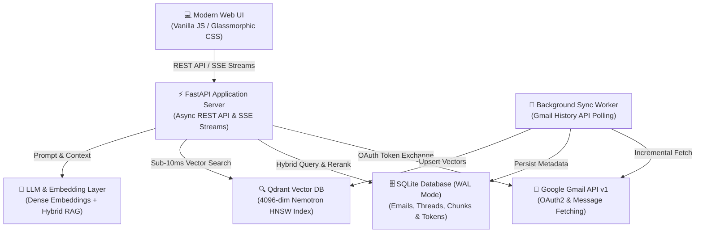
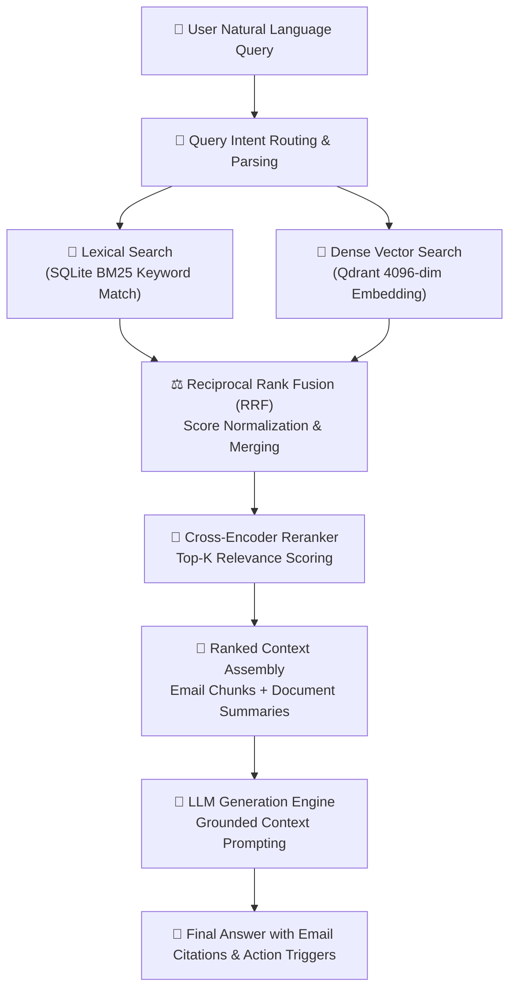

# 📧 SmartMail AI

> **A production-oriented, AI-powered Gmail client with hybrid RAG search, document intelligence, and natural-language inbox control.**

[](https://python.org)
[](https://fastapi.tiangolo.com)
[](https://qdrant.tech)
[](https://sqlite.org)
[](https://www.docker.com)
[](https://github.com/Akshit8459/SmartMailAI/actions)
[](LICENSE)

---

## 🎬 Demo

```
 ┌────────────────────────────────────────────────────────────────────────────────────────┐
 │ 🔑 Google OAuth2 Login  ➜  📩 Gmail Sync  ➜  🔍 Hybrid RAG  ➜  📄 Attachment Analysis  │
 └────────────────────────────────────────────────────────────────────────────────────────┘
```

<div align="center">

| Showcase Card | Operational Flow & Capabilities |
| :--- | :--- |
| **🔑 Auth & Inbox Sync** | OAuth2 login returning in **< 100ms**; background sync indexes emails & labels asynchronously. |
| **🔍 Hybrid RAG Query** | Natural language email search combining BM25 keyword matching with **4096-dim vector search**. |
| **📄 Attachment Analysis** | Extracts multi-page PDF, PPTX, DOCX, & image contents into structured AI executive summaries. |
| **⚡ Inbox AI Actions** | Conversational inbox management (*archive*, *star*, *mark read*, *delete*, *reply*, *forward*). |

</div>

> [!NOTE]
> **Security Note:** SmartMail AI requests Gmail API permissions strictly for local application execution. OAuth credentials and tokens are encrypted (AES-256) and never committed to the repository or transmitted to third parties. See [SECURITY.md](SECURITY.md) for details.

---

## 💡 Why SmartMail AI?

Traditional email search relies on rigid keyword matching that misses semantic intent and context spread across attached files. **SmartMail AI** bridges this gap by combining **lexical keyword search (BM25)** with **dense vector embeddings (4096-dimensional)** to enable conversational querying over inbox messages and multi-format document attachments while maintaining direct source citations and interactive control.

---

## ✨ Key Features

- 🔍 **Hybrid RAG Search**: Combines BM25 lexical keyword matching and 4096-dimensional dense vector embeddings with Reciprocal Rank Fusion (RRF) and cross-encoder reranking.
- 📩 **Non-Blocking Gmail Sync**: Instant OAuth2 sign-in (< 100ms callback) with non-blocking background synchronization using Gmail's History API (`users.messages.history.list`).
- 📄 **Document Intelligence**: Full text parsing and executive AI summaries across 22+ page PDF, PPTX, DOCX, and image attachments.
- ⚡ **Natural-Language Inbox Control**: Execute operations like *archive*, *star*, *mark read*, *delete*, *reply*, and *forward* directly via conversational AI prompts.
- 🗄️ **Scalable Vector Architecture**: High-performance Qdrant vector database integration with automatic SQLite WAL mode fallback.
- 📊 **Real-Time Telemetry Dashboard**: Live monitoring of indexed vector chunks, retrieval latency, embedding dimensions, and Qdrant status.

---

## ⚡ Performance

| Metric | Result | Target Benchmark |
| :--- | :---: | :---: |
| **OAuth Callback Latency** | **< 100ms** | Sub-100ms responsive auth |
| **Initial Inbox Load** | **< 1s** | Sub-second interface render |
| **Hybrid RAG Latency** | **< 2s** | Real-time conversational search |
| **Embedding Dimension** | **4096-dim** | High-density semantic vectors |
| **Vector DB Search** | **Sub-10ms** | Qdrant HNSW Cosine Index |
| **CI Test Suite** | **5/5 Passing** | Automated GitHub Actions CI |

---

## 📐 System Architecture


```mermaid
graph TD
    Client["💻 Modern Web UI<br>(Vanilla JS / Glassmorphic CSS)"]
    FastAPI["⚡ FastAPI Application Server<br>(Async REST API & SSE Streams)"]
    Worker["🔄 Background Sync Worker<br>(Gmail History API Polling)"]
    Gmail["📩 Google Gmail API v1<br>(OAuth2 & Message Fetching)"]
    SQLite["🗄️ SQLite Database (WAL Mode)<br>(Emails, Threads, Chunks & Tokens)"]
    Qdrant["🔍 Qdrant Vector DB<br>(4096-dim Nemotron HNSW Index)"]
    AI["🧠 LLM & Embedding Layer<br>(Dense Embeddings + Hybrid RAG)"]

    Client -->|REST API / SSE Streams| FastAPI
    FastAPI -->|OAuth Token Exchange| Gmail
    Worker -->|Incremental Fetch| Gmail
    Worker -->|Persist Metadata| SQLite
    Worker -->|Upsert Vectors| Qdrant
    FastAPI -->|Hybrid Query & Rerank| SQLite
    FastAPI -->|Sub-10ms Vector Search| Qdrant
    FastAPI -->|Prompt & Context| AI
```

---

## 🧠 RAG Retrieval Pipeline


```mermaid
graph TD
    A["👤 User Natural Language Query"] --> B["🔎 Query Intent Routing & Parsing"]
    B --> C1["📝 Lexical Search<br>(SQLite BM25 Keyword Match)"]
    B --> C2["🧮 Dense Vector Search<br>(Qdrant 4096-dim Embedding)"]
    C1 --> D["⚖️ Reciprocal Rank Fusion (RRF)<br>Score Normalization & Merging"]
    C2 --> D
    D --> E["🎯 Cross-Encoder Reranker<br>Top-K Relevance Scoring"]
    E --> F["📄 Ranked Context Assembly<br>Email Chunks + Document Summaries"]
    F --> G["🧠 LLM Generation Engine<br>Grounded Context Prompting"]
    G --> H["💬 Final Answer with Email Citations & Action Triggers"]
```

---

## 🛠️ Tech Stack

- **Backend**: FastAPI 0.115+, Python 3.12, SQLAlchemy 2.0 (Async ORM)
- **Database & Storage**: SQLite (WAL Mode, `NullPool` engine), Qdrant Vector DB v1.10
- **AI & RAG Engine**: Dense Vector Embeddings (4096-dim), Lexical BM25, Reciprocal Rank Fusion (RRF), Cross-Encoder Reranking
- **LLM Engine**: Provider-agnostic LLM interface (defaulting to Llama 3.3 70B & Nemotron Embeddings)
- **Frontend**: Vanilla HTML5 / Glassmorphic CSS3 / JavaScript (ES6+), Lucide Icons
- **Infrastructure & Containerization**: Docker, Docker Compose, GitHub Actions CI

---

## ⚡ Quick Start

### 1. Clone & Setup Environment
```bash
git clone https://github.com/Akshit8459/SmartMailAI.git
cd SmartMailAI
cp .env.example .env
```

### 2. Configure Environment Variables
Fill in your OAuth & LLM API keys in `.env`:
```env
GOOGLE_CLIENT_ID=your_client_id
GOOGLE_CLIENT_SECRET=your_client_secret
NVIDIA_API_KEY=your_nvidia_api_key
```

### 3. Run with Docker Compose
```bash
docker-compose up --build
```
Access the application at **`http://localhost:8000`**.

---

## 🔒 Security

SmartMail AI prioritizes user data privacy and security:
- **AES-256 Encryption**: Google OAuth tokens and refresh tokens are encrypted at rest.
- **Minimal OAuth Scopes**: Requests only required Gmail API permissions (`gmail.readonly`, `gmail.modify`).
- **No Third-Party Token Exposure**: Credentials are handled exclusively on your local or private instance.
- See [SECURITY.md](SECURITY.md) for full compliance details.

---

## 📚 Documentation & Deep Dives

- 📘 [User Guide](USER_GUIDE.md): Detailed feature walkthrough for end users.
- 💻 [Developer Guide](DEVELOPER_GUIDE.md): Local environment setup, project structure, and background worker design.
- 🏗️ [Architecture Deep Dive](ARCHITECTURE.md): Class diagrams, database schemas, and vector index configurations.
- 🏛️ [Architecture Decision Records (ADRs)](DECISIONS.md): Key engineering trade-offs and rationale.
- 🔒 [Security Policy](SECURITY.md): Token encryption, OAuth scopes, and security posture.
- 📜 [Changelog](CHANGELOG.md): Version history and release notes.

---

## 🧪 Testing

Run the automated Pytest suite for backend and RAG engine verification:
```bash
python -m pytest backend/tests/ -v
```

---

## 🗺️ Roadmap

- [x] Multi-format attachment extraction & AI summaries
- [x] Natural language inbox control actions
- [x] Qdrant vector database integration with SQLite fallback
- [ ] Multi-account Gmail indexing & switching
- [ ] Local Ollama / ONNX offline LLM support

---

## 📜 License

This project is licensed under the [MIT License](LICENSE).
